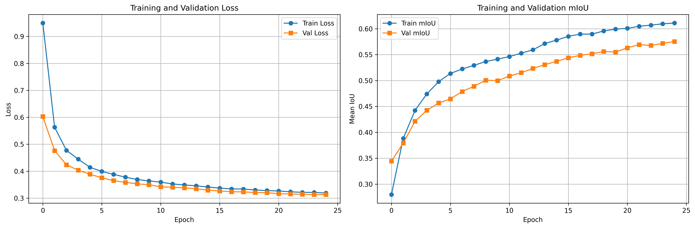

# Off-Road Semantic Segmentation with SegFormer

A deep learning project for semantic segmentation of off-road terrain images using the SegFormer architecture. This project was developed for the Duality.ai Hackathon and focuses on classifying 10 different terrain types commonly found in off-road environments.

## 🎯 Overview

This project implements a semantic segmentation model to classify off-road terrain at the pixel level. Using the SegFormer-B0 architecture pre-trained on ADE20K and fine-tuned on custom off-road data, the model achieves high-quality segmentation of diverse terrain features.

### Target Classes (10 Classes)

| Class ID | Original ID | Class Name      | Description |
|----------|-------------|-----------------|-------------|
| 0        | 100         | Trees           | Forest trees and large vegetation |
| 1        | 200         | Lush Bushes     | Green, healthy bushes |
| 2        | 300         | Dry Grass       | Dead or dry grass areas |
| 3        | 500         | Dry Bushes      | Brown, dry bushes |
| 4        | 550         | Ground Clutter  | Small debris on ground |
| 5        | 600         | Flowers         | Flowering plants |
| 6        | 700         | Logs            | Fallen trees and logs |
| 7        | 800         | Rocks           | Stones and rocky terrain |
| 8        | 7100        | Landscape       | General landscape features |
| 9        | 10000       | Sky             | Sky regions |

## ✨ Key Features

- 🚀 **SegFormer Architecture**: Uses NVIDIA's SegFormer-B0 model with efficient transformer-based design
- 📊 **Comprehensive Metrics**: IoU (Intersection over Union) tracking per class and mean IoU
- 📈 **Training Visualization**: Automatic plotting of loss and mIoU curves
- 🎨 **Visual Results**: Side-by-side comparison of predictions vs ground truth
- 💾 **Checkpoint Management**: Auto-saves best model and periodic checkpoints
- 🔍 **Detailed Evaluation**: Per-class IoU analysis with bar charts

## 📁 Project Structure

```
Dualityai-hackathon/
├── train.py                 # Training script with IoU tracking
├── test.py                  # Testing and evaluation script
├── requirements.txt         # Python dependencies
├── training_history.png     # Training/validation curves
├── runs/                    # Model checkpoints
│   ├── best_model.pth      # Best model by validation IoU
│   └── checkpoint_epoch_*.pth
└── test_results/            # Test evaluation outputs
    ├── test_results.txt    # Detailed metrics
    ├── per_class_iou.png   # IoU bar chart
    └── visualizations/     # Sample predictions
```

## 📊 Training Results

The model shows excellent convergence over 25 epochs with steady improvement in both loss and mean IoU metrics:



**Key Observations:**
- **Loss Reduction**: Training loss drops dramatically from ~0.95 to ~0.32, with validation loss stabilizing around 0.32
- **mIoU Improvement**: Training mIoU increases from 0.28 to 0.62, validation mIoU reaches 0.57
- **Convergence**: Both metrics show good convergence with minimal overfitting
- **Stable Training**: Smooth curves indicate stable learning without significant fluctuations

## 🚀 Installation

###
